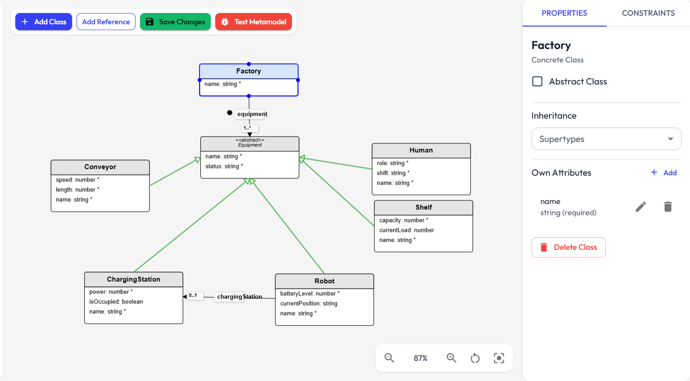
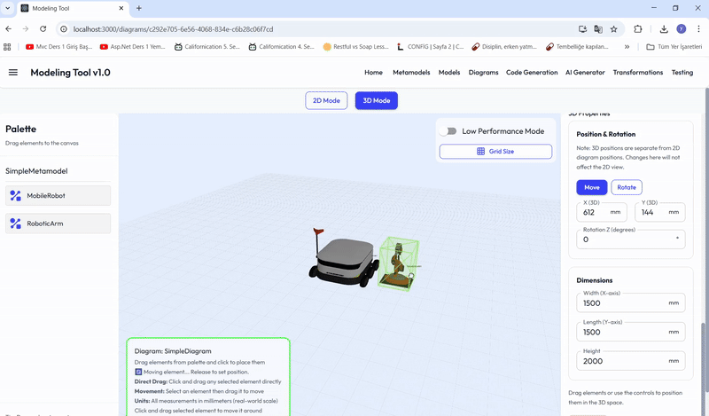

# Spatial DSL Studio
 <br><br>


<p align="center">
  
  <br><br>
  
</p>

## Overview
SpatialDSLStudio is a web-based application for creating domain-specific languages (DSLs) and visual modeling environments with 2D and 3D visualization capabilities. The tool also defines models and generates code for layouts and components that can be used directly in simulation tools such as [Visual Components](https://www.visualcomponents.com/).

Spatial DSL Studio implements a multi-level modeling architecture based on Model-Driven Engineering principles. The application provides tools for defining metamodels, creating conforming models, visualizing them in both 2D and 3D spaces, applying model transformations, and generating code from models.

The tool follows a four-layer architecture:
- Meta-Metamodel Level (M3): Core language definition. Metamodels must conform to meta-metamodels
- Metamodel Level (M2): Domain-specific languages defined as instances of the meta-metamodel  
- Model Level (M1): Concrete models conforming to their metamodels
- Visualization Level: 2D and 3D representations of models


## Main Features

- Multi-level modeling architecture (M3-M2-M1) with conformance checking
- Visual metamodel editor with abstract classes and inheritance support
- Model editor with OCL and JavaScript constraint validation
- 2D and 3D diagram editors with interactive element manipulation
- Graph-based model transformations using pattern matching(implements VF2-Algorithm)
- Template-based code generation(via Handlebars Templates)
- Self-referencing and reference attributes for complex relationships

## Installation

### Prerequisites
- Node.js 16 or higher
- Web browser with WebGL support

### Setup

```bash
git clone https://github.com/yourusername/spatial-dsl-studio.git
cd spatial-dsl-studio
npm install
npm start
```

The application will be available at `http://localhost:3000`.

## Usage

### Basic Workflow

1. **Create Metamodel**: Define domain-specific language with classes, attributes, and relationships
2. **Build Model**: Create instances that conform to the metamodel with validation
3. **Visualize**: Generate 2D or 3D diagrams from model elements
4. **Transform**: Apply pattern-based transformations between models(LHS,RHS,NAC)  

5. **Generate Code**: Use handlebars templates to produce source code from models

## Project Structure

```
SpatialDSLStudio/
├── docs/                # Documentation for features and workflows
├── images/              # Images and GIFs for documentation and UI
├── src/                 # Main source code
│   ├── App.tsx, index.tsx, ...         # App entry points and global styles
│   ├── components/      # UI components, grouped by domain
│   │   ├── ai/                  # AI-assisted metamodel generation
│   │   ├── codegeneration/      # Code generation UI
│   │   ├── common/              # Shared dialogs and utilities
│   │   ├── diagram/             # 2D/3D diagram editors and visualization
│   │   ├── metamodel/           # Metamodel editors and constraint tools
│   │   ├── model/               # Model editors and appearance selectors
│   │   ├── palette/             # Palette for diagram/model elements
│   │   ├── testing/             # Model-based testing dashboard and reports
│   │   └── transformation/      # Transformation rule editors and execution
│   ├── migrations/      # Migration scripts for data/schema evolution
│   ├── models/          # TypeScript type definitions for all core concepts
│   ├── services/        # Business logic and data services (CRUD, codegen, AI, etc.)
│   ├── types/           # TypeScript type declarations for external libraries
│   └── template-theme.css  # Custom theme and style overrides
├── videos/              # Demo and tutorial videos
├── next.config.js, tsconfig.json, package.json, ...  # Project configuration
└── README.md            # Project overview and instructions
```

- **docs/**: Guides for metamodeling, model/diagram creation, transformation, and code generation.
- **src/components/**: Modular React components for each major feature (metamodeling, modeling, diagrams, transformation, codegen, testing, AI).
- **src/services/**: Logic for persistence, code generation, AI, validation, and transformation.
- **src/models/types.ts**: Centralized type definitions for metamodels, models, diagrams, rules, and codegen.
- **src/migrations/**: Scripts for migrating or updating stored data.
- **src/types/**: TypeScript declarations for third-party libraries.

Detailed instructions for each step are available in the documentation files.

## Documentation

- [Metamodel Creation](docs/MetamodelCreation.md) - Define domain-specific languages
- [Model Creation](docs/ModelCreation.md) - Build and validate models with constraints  
- [Diagram Editing](docs/DiagramCreation.md) - Create 2D and 3D visualizations
- [Model Transformations](docs/TransformationRules.md) - Pattern-based model transformations
- [Code Generation](docs/CodeGeneration.md) - Template-based source code generation

## Demonstration Videos

- [Metamodel Creation](videos/metamodel_creation.mkv) - An example Robot Metamodel Creation with OCL constraint usage.
- [Model Creation](videos/model_creation.mkv) - An example model creation that conforms to Robot Metamodel.  
- [Diagram Editing](videos/diagram_creation.mkv) - Example 2D and 3D diagram creation for Robot Model.
- [Model Transformations](videos/transformation_rule_creation.mkv) - An example transformation rule creation.
- **[Case Study Code Generation and Deployment](casestudy_artifacts/case_study_demonstration.mkv)** - Demonstration video for agent-based manufacturing simulation code generation and deployment. This case study is explained in thesis chapter 7.


## Browser Compatibility

- Chrome 90+
- Firefox 88+
- Edge 90+
- Safari 14+

WebGL support is required for 3D visualization features.

## Architecture

The application uses a component-based architecture with separation of concerns:

**Core Components:**
- Diagram Editor: 2D visual editing with Konva.js
- Diagram3D Editor: 3D spatial editing with Three.js
- Metamodel Editor: Interface for metamodel definition
- Model Editor: Interface for model creation and editing
- Transformation Editor: Pattern and rule definition interface
- Code Generator: Template editing and code generation

**Services Layer:**
- Metamodel Service: Manages metamodel operations and validation
- Model Service: Handles model operations with conformance checking
- Diagram Service: Manages visual representation data
- Transformation Service: Implements VF2-based model transformations
- Code Generation Service: Template processing and file generation

**Data Models:**
- Type definitions for metamodel components (MetaClass, MetaAttribute, MetaReference)
- Model instance types with conformance validation
- Diagram element types for visual representation
- Transformation pattern and rule definitions

