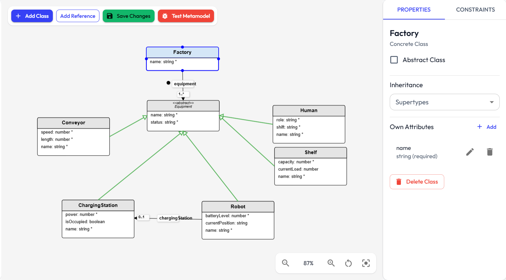
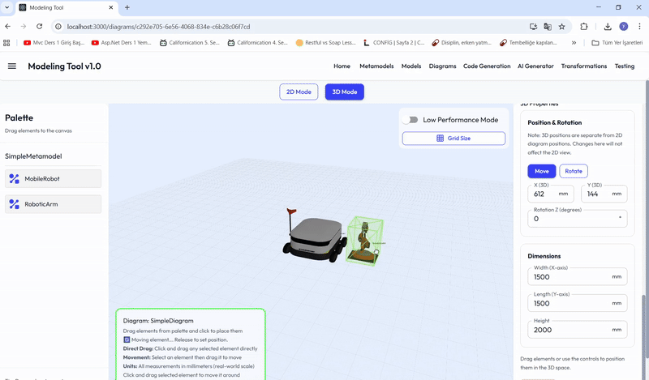

# SpatialDSL Studio

[](https://github.com/micss-lab/SpatialDSLStudio/actions/workflows/ci.yml)
[](https://github.com/micss-lab/SpatialDSLStudio/actions/workflows/deploy.yml)
[](https://github.com/micss-lab/SpatialDSLStudio/actions/workflows/health-check.yml)

<p align="center">
  <a href="https://www.uantwerpen.be/en/">
    
  </a>
</p>

<p align="center">
  Developed at the <a href="https://micss-lab.github.io/">MICSS (Modeling Intelligent Complex Software and Systems)</a> lab<br>
  <a href="https://ansymo.uantwerpen.be/">AnSyMo (Antwerp Systems and Software Modeling)</a> group<br>
  <a href="https://www.uantwerpen.be/en/">University of Antwerp</a>
</p>

<p align="center">
  
  <br><br>
  
</p>

## Overview
A full-stack model-driven engineering platform for designing domain-specific languages and working with models end-to-end.

**Live demo:** [https://dsl-studio.micss-lab.be](https://dsl-studio.micss-lab.be)

You can:

- Define metamodels (classes, attributes, references, constraints)
- Create models that conform to those metamodels
- Visualize and edit diagrams in 2D and 3D
- Define transformation rules (LHS/RHS/NAC)
- Build code generation projects with templates
- Manage access with roles and resource sharing

## Multi-Layer Architecture

Spatial DSL Studio implements a multi-level modeling architecture based on Model-Driven Engineering principles ([MOF](https://en.wikipedia.org/wiki/Meta-Object_Facility)). The application provides tools for defining metamodels, creating conforming models, visualizing them in both 2D and 3D spaces, applying model transformations, and generating code from models.

The tool follows a four-layer architecture:
- Meta-Metamodel Level (M3): Core language definition. Metamodels must conform to meta-metamodels
- Metamodel Level (M2): Domain-specific languages defined as instances of the meta-metamodel
- Model Level (M1): Concrete models conforming to their metamodels
- Visualization Level (M1): 2D and 3D representations of models
- Code Generation Level (M0): Auto code generation from the designed models(Template-based)

## Tech Stack

- Frontend: React + TypeScript + Material UI
- Backend: Node.js + Express + TypeScript
- Database: PostgreSQL + Prisma ORM
- Visualization: Konva (2D) and Three.js / React Three Fiber (3D)
- Deployment: Docker Compose (frontend + backend + database)

## Repository Structure

- `frontend/` - React application, editors, dashboards, user workflows
- `backend/` - Express API, business services, auth, RBAC, sharing
- `shared/` - Shared type contracts used by frontend and backend
- `docker-compose.yml` - Full-stack container orchestration

## Quick Start

### Option A: Docker (recommended)

```bash
docker compose up --build
```

Then open:

- App: `http://localhost:3000`
- API: `http://localhost:3002`

### Option B: Local development

Run backend and frontend in separate terminals:

```bash
# backend
cd backend
npm ci
npm run dev

# frontend
cd frontend
npm ci
npm start
```

For complete setup requirements (database, env vars, migrations), see the getting started docs.

## Documentation

### Start Here

- [Documentation Hub](docs/README.md)

### Getting Started

- [Local Setup](docs/getting-started/local-setup.md)
- [Docker Setup](docs/getting-started/docker-setup.md)
- [Environment Configuration](docs/getting-started/environment.md)

### User Guides

- [Metamodels](docs/user-guide/metamodels.md)
- [Models](docs/user-guide/models.md)
- [Diagrams (2D and 3D)](docs/user-guide/diagrams.md)
- [Transformations](docs/user-guide/transformations.md)
- [Code Generation](docs/user-guide/code-generation.md)
- [Roles and Sharing](docs/user-guide/roles-and-sharing.md)

### Technical References

- [API Reference](docs/reference/api.md)
- [Data Model](docs/reference/data-model.md)
- [Architecture](docs/reference/architecture.md)
