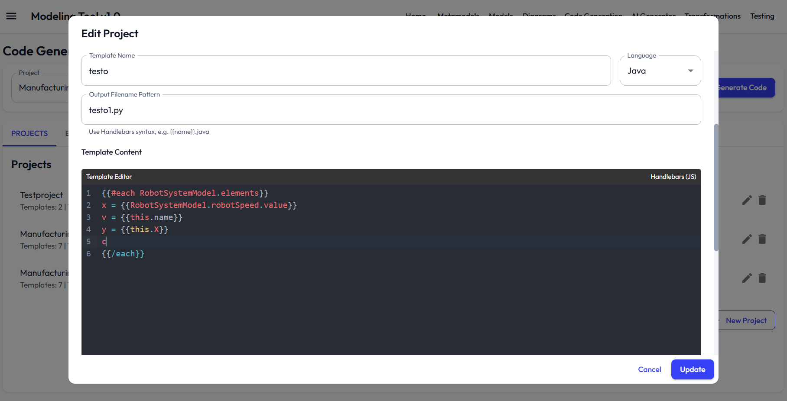

# Code Generation Documentation

---

## Relevant Files

- [`src/components/codegeneration/CodeGenerator.tsx`](../src/components/codegeneration/CodeGenerator.tsx): Main UI for managing code generation projects, editing templates, and running code generation.
- [`src/services/codegeneration.service.ts`](../src/services/codegeneration.service.ts): Service for managing code generation projects, templates, context building, Handlebars integration, and file output.
- [`src/models/types.ts`](../src/models/types.ts): Type definitions for code generation projects, templates, results, and related model/metamodel structures.

---

This document describes the process and features involved in code generation within the modeling tool. The information is based on the codebase and covers the main aspects of template-based code generation, project management, and the use of models, diagrams, and metamodels for generating code artifacts.

  

  

## Overview

Code generation is the process of producing source code files from models and diagrams using user-defined templates. The system allows users to define, edit, and manage code generation projects and templates. Code generation is template-driven and leverages the structure and data of models, diagrams, and metamodels.

## Code Generation Projects

- Code generation is organized into projects. Each project targets a specific metamodel and contains one or more templates.
- Projects can be created, edited, and deleted by the user. Each project has a name, description, and a target metamodel.
- Templates within a project define how code is generated for elements of the model or diagram.
- Example projects and templates are provided for reference and can be used as starting points.

## Templates

- Templates are written using Handlebars syntax, allowing for dynamic content generation based on model and diagram data.
- Each template specifies the template content, and an output filename pattern.
- Templates can access properties of elements, iterate over collections, and use helpers for formatting and logic.
- Common helpers include capitalization, case conversion, string concatenation, and conditional logic.
- Templates can access metamodel and model information, including classes, attributes, references, and element values.

**Use Handlebars Syntax**:
   - Access element properties: `{{metamodelName.className.propertyName}}`
   - Access element references: `{{metamodelName.className.referenceName}}`
   - Iterate over elements: `{{#each elements}}...{{/each}}`
   - Access metamodel: `{{metamodelname}}`
   - Access model: `{{modelname}}`
   - Use conditional logic: `{{#if condition}}...{{/if}}`
   - Use helper functions: `{{capitalize name}}`, `{{lowercase name}}`, etc.
   
   For detailed information please visit: https://handlebarsjs.com/guide/

## Model and Diagram Context

- Code generation uses the data from models and diagrams as input for templates.
- The system builds a context object that includes:
  - The current element's properties and attributes.
  - All elements in the model or diagram, grouped by class and name.
  - The metamodel structure, including classes, attributes, and references.
  - The model structure, including all elements and their values.
- The context allows templates to generate code that reflects the structure and data of the model and diagram.

## Generating Code

- Users select a code generation project and initiate code generation.
- The system determines the relevant model and diagram based on the selected project and available data.
- For each template in the project, the system compiles the template and applies it to the context built from the model and diagram.
- The output is a set of files, each with a generated filename and content based on the template and context.
- Generated files can be previewed and downloaded individually.

## Editing and Managing Projects

- Users can create new projects, add or remove templates, and edit template content and output patterns.
- Templates can be edited in a code editor with syntax highlighting.
- Example templates can be loaded and used as a basis for new projects.

