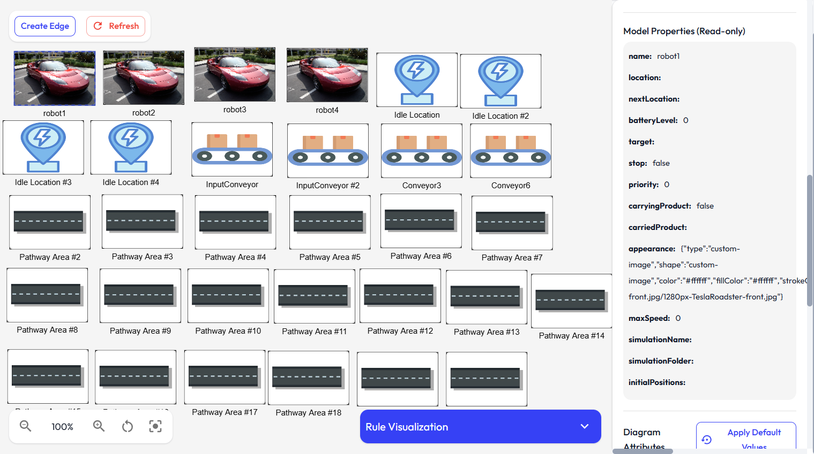

# Diagram Creation Documentation

This document describes the process and features involved in creating diagrams, including both 2D and 3D diagrams. 

  

  

---

## Relevant Files

- [`src/components/diagram/DiagramEditor.tsx`](../src/components/diagram/DiagramEditor.tsx): Main 2D diagram editor for creating and editing diagrams visually.
- [`src/components/diagram/Diagram3DEditor.tsx`](../src/components/diagram/Diagram3DEditor.tsx): 3D diagram editor for spatial arrangement and visualization.
- [`src/components/diagram/DiagramElementProperties.tsx`](../src/components/diagram/DiagramElementProperties.tsx): Editor for diagram element properties and attributes.
- [`src/components/diagram/ElementAppearanceSelector.tsx`](../src/components/diagram/ElementAppearanceSelector.tsx): UI for customizing the appearance (shape, color, image, etc.) of diagram elements.
- [`src/components/palette/DiagramPalette.tsx`](../src/components/palette/DiagramPalette.tsx): Palette for dragging metamodel classes onto the diagram canvas.
- [`src/services/diagram.service.ts`](../src/services/diagram.service.ts): Service for diagram CRUD operations, persistence, import/export, and grid settings.
- [`src/services/appearance.service.ts`](../src/services/appearance.service.ts): Service for managing appearance settings and conversions for diagram elements.
- [`src/components/diagram/RuleVisualizationPanel.tsx`](../src/components/diagram/RuleVisualizationPanel.tsx): Panel for visualizing transformation rules and their execution on diagrams.
- [`src/components/diagram/Node3D.tsx`](../src/components/diagram/Node3D.tsx): Component for rendering 3D node elements in diagrams.
- [`src/components/diagram/ShapeIndicator3D.tsx`](../src/components/diagram/ShapeIndicator3D.tsx): 3D shape indicator for element type visualization in 3D diagrams.

---

## Overview

Diagrams are visual representations of models. They can be created in both two-dimensional (2D) and three-dimensional (3D) formats. Each diagram is associated with a model and contains elements that represent nodes and edges. Diagrams support customization of appearance, layout, and properties for each element.

## Creating a Diagram

- Diagrams are created by specifying a name and selecting the model they will represent.
- Each diagram is assigned a unique identifier and initialized with default grid settings.
- Diagrams are stored and managed locally, allowing for persistence and retrieval.

## Diagram Elements

- Elements in a diagram can be nodes or edges.
- Nodes represent entities and can be placed anywhere within the diagram's grid.
- Edges represent relationships between nodes and can include bend points for custom routing.
- Each element is linked to a metamodel class or reference, which defines its type and available attributes.
- Elements have customizable properties, including position, size, appearance, and style.
- Elements can be linked to model elements, allowing for synchronization of names and properties.

## 2D Diagram Editing

- The 2D diagram editor provides a canvas for placing and arranging elements.
- Users can drag and drop elements from a palette onto the canvas to create new nodes.
- Edges can be drawn between nodes by selecting a source and target.
- The editor supports zooming, panning, and centering the view on elements.
- Elements can be selected to edit their properties, including name, appearance, and linked model element.
- The appearance of nodes can be customized with shapes (rectangle, square, circle, triangle, star), colors, and custom images.
- Edges can be customized with reference types and attributes.
- The editor allows for free movement of elements without boundary constraints.

## 3D Diagram Editing

- The 3D diagram editor provides a three-dimensional workspace for arranging elements.
- Users can add nodes by dragging from the palette and clicking on the 3D grid.
- Nodes can be moved directly in 3D space using drag-and-drop interactions.
- The 3D editor supports camera controls, including orbiting, zooming, and panning.
- The grid can be expanded automatically as elements are placed further from the center.
- Elements can be rotated and positioned with millimeter precision.
- The appearance of nodes can include 3D shapes and custom 3D models (GLB format).
- Shape indicators and labels help identify elements in the 3D view.
- The editor provides performance modes to accommodate different hardware capabilities.

## Element Properties and Appearance

- Each element has a set of properties defined by its metamodel class or reference.
- Elements can inherit appearance and names from linked model elements.
- Appearance options include shape, color, custom images, and 3D models.
- Appearance can be previewed and adjusted in real time.

## Grid and Layout

- Diagrams use a grid system to help with alignment and placement of elements.
- The grid size can be adjusted for both axes, and the grid expands as needed.
- Grid settings are saved with the diagram for consistency.

## Import and Export

- Diagrams can be exported to JSON format for backup or sharing.

## Rule Visualization

- Diagrams support visualization of transformation rules and their execution steps.
- Users can select and execute rules, view step-by-step transformations, and highlight affected elements.
- Playback controls allow for stepwise or automatic progression through rule applications.

