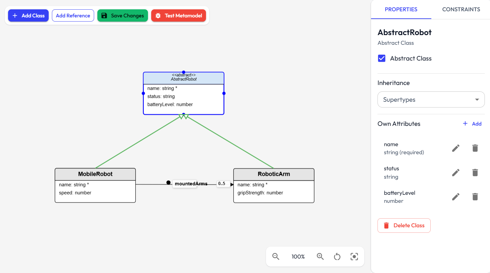

# Metamodel Creation Documentation

This document provides a metamodel creation process in the modeling tool. It covers the relevant UI components, services, data structures, and workflows involved in defining, editing, and managing metamodels.

   

  

---

## 1. Overview

Metamodel creation is the process of defining the abstract structure, types, and constraints for a domain-specific modeling language. In this tool, metamodels are managed through a combination of UI components (for visual and textual editing) and service logic (for behind the scenes).

---

## 2. Relevant Files

- [`src/components/metamodel/VisualMetamodelEditor.tsx`](../src/components/metamodel/VisualMetamodelEditor.tsx): Visual editor for metamodels.  
- [`src/components/metamodel/MetamodelManager.tsx`](../src/components/metamodel/MetamodelManager.tsx): Manages the list of metamodels, import/export, and selection.  
- [`src/components/metamodel/ConstraintTypeSelector.tsx`](../src/components/metamodel/ConstraintTypeSelector.tsx): UI for switching between OCL and JavaScript constraint editors.  
- [`src/components/metamodel/OCLConstraintEditor.tsx`](../src/components/metamodel/OCLConstraintEditor.tsx): Editor for OCL constraints.  
- [`src/components/metamodel/JSConstraintEditor.tsx`](../src/components/metamodel/JSConstraintEditor.tsx): Editor for JavaScript constraints.  
- [`src/services/metamodel.service.ts`](../src/services/metamodel.service.ts): Service for CRUD operations, validation, and persistence of metamodels.  

---

## 3. Metamodel Lifecycle

### 3.1. Creation
- Users create a new metamodel via the [`MetamodelManager`](../src/components/metamodel/MetamodelManager.tsx) component.
- The service ([`metamodel.service.ts`](../src/services/metamodel.service.ts)) generates a new metamodel object with a unique ID, name, URI, prefix, and empty class list.
- The new metamodel is stored in `localStorage`.

### 3.2. Editing
- The [`VisualMetamodelEditor`](../src/components/metamodel/VisualMetamodelEditor.tsx) provides a canvas for adding, positioning, and editing metaclasses, attributes, and references.
- Classes can be added, renamed, deleted, and configured as abstract or concrete.
- Attributes and references are managed per class, with support for types, multiplicity, containment, and default values.
- Inheritance (superTypes) can be set for each class.
- All changes are persisted via the service.

### 3.3. Constraints
- Constraints can be added to classes using either OCL ([`OCLConstraintEditor`](../src/components/metamodel/OCLConstraintEditor.tsx)) or JavaScript ([`JSConstraintEditor`](../src/components/metamodel/JSConstraintEditor.tsx)).
- The [`ConstraintTypeSelector`](../src/components/metamodel/ConstraintTypeSelector.tsx) allows switching between constraint types.
- Constraints are stored as part of the metamodel and are validated for syntax and applicability.

### 3.4. Import/Export
- Metamodels can be imported from JSON or Ecore/XMI formats.
- Export is available in JSON or Ecore formats.
- Import/export logic is handled in [`MetamodelManager`](../src/components/metamodel/MetamodelManager.tsx) and the service layer ([`metamodel.service.ts`](../src/services/metamodel.service.ts)).

---

## 4. Service Logic ([`metamodel.service.ts`](../src/services/metamodel.service.ts))

- **CRUD Operations**: Methods for creating, updating, deleting, and retrieving metamodels and their components (classes, attributes, references, constraints).  
- **Validation**: Ensures metamodels conform to the meta-metamodel, checks for required fields, duplicate names, valid references, and bidirectional reference consistency.  
- **Migration**: Handles schema evolution and ensures backward compatibility for older metamodels.  
- **Import/Export**: Supports JSON, Ecore, XMI, and PUML (PlantUML) formats for interoperability.

---
