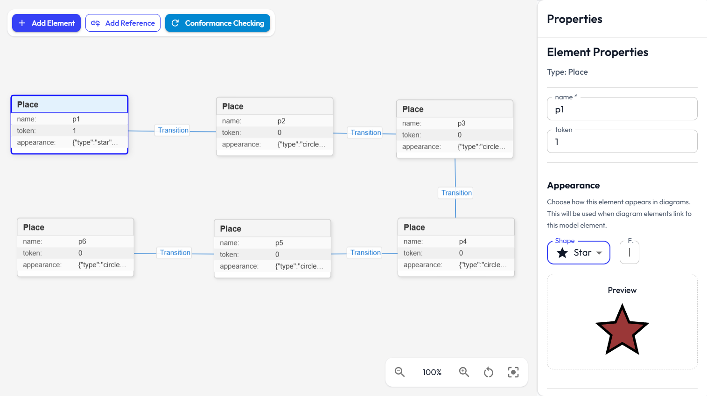

# Model Creation Documentation

This document provides an overview of the model creation process in the modeling tool. It covers the relevant UI components, services, data structures, and workflows involved in defining, editing, and managing models.

  

  

---

## 1. Overview

Model creation involves defining instances that conform to a selected metamodel. Models are composed of elements, each corresponding to a metaclass, with attribute values and references as specified by the metamodel. The process is managed through a combination of UI components (for visual and form-based editing) and service logic.

---

## 2. Relevant Files

- [`src/components/model/VisualModelEditor.tsx`](../src/components/model/VisualModelEditor.tsx): Visual editor for models.  
- [`src/components/model/ModelManager.tsx`](../src/components/model/ModelManager.tsx): Manages the list of models, import/export, and selection.  
- [`src/components/model/ModelElementAppearanceSelector.tsx`](../src/components/model/ModelElementAppearanceSelector.tsx): Form for editing appearance and style of model elements (note: the appearance will take effect on the created diagrams, not the models).  
- [`src/services/model.service.ts`](../src/services/model.service.ts): Service for CRUD operations, validation, and persistence of models.  

---

## 3. Model Lifecycle

### 3.1. Creation
- A new model is initialized with a unique ID, name, reference to a metamodel, and an empty element list.  
- The model is stored in `localStorage`.  

### 3.2. Editing
- The [`VisualModelEditor`](../src/components/model/VisualModelEditor.tsx) provides a canvas for adding, positioning, and editing model elements.  
- Elements are instantiated based on concrete (non-abstract) metaclasses from the selected metamodel.  
- Each element is assigned attribute values and references according to the metamodel definition.  
- Attributes and references can be edited via visual or form-based editors.  
- Appearance and style can be configured using the [`ModelElementAppearanceSelector`](../src/components/model/ModelElementAppearanceSelector.tsx).  
- All changes are persisted via the service ([`model.service.ts`](../src/services/model.service.ts)).  

### 3.3. References
- References between elements are established according to the metamodel's reference definitions.  
- Both single-valued and multi-valued references are supported.  
- Bidirectional references are updated on both source and target elements.  
- Reference attributes and bend points for visualization can be set.  

### 3.4. Import/Export
- Models can be imported from and exported to JSON format.  
- Import/export logic is handled in [`ModelManager`](../src/components/model/ModelManager.tsx) and the service layer ([`model.service.ts`](../src/services/model.service.ts)).  

---

## 5. Service Logic ([`model.service.ts`](../src/services/model.service.ts))

- **CRUD Operations**: Methods for creating, updating, deleting, and retrieving models and their elements.  
- **Element Instantiation**: Elements are created based on metaclasses, with default values for attributes and empty references initialized.  
- **Reference Management**: Methods for setting, updating, and deleting references, including bidirectional consistency.  
- **Validation**: Ensures models conform to the metamodel, checks for required attributes, type correctness, reference cardinality, and constraint satisfaction (OCL/JS).  
- **Migration**: Handles schema evolution and ensures backward compatibility for older models.  
- **Import/Export**: Supports JSON format for interoperability.  

---

## 6. UI Workflows

- **[`ModelManager`](../src/components/model/ModelManager.tsx)**: List, create, delete, import, and export models. Select a model for editing.  
- **[`VisualModelEditor`](../src/components/model/VisualModelEditor.tsx)**: Edit the structure of the selected model visually. Add/edit/delete elements, set attribute values, manage references, and position elements on the canvas.  
- **[`ModelElementAppearanceSelector`](../src/components/model/ModelElementAppearanceSelector.tsx)**: Edit appearance and style of model elements, including shape, color, image, and 3D model.  

---
