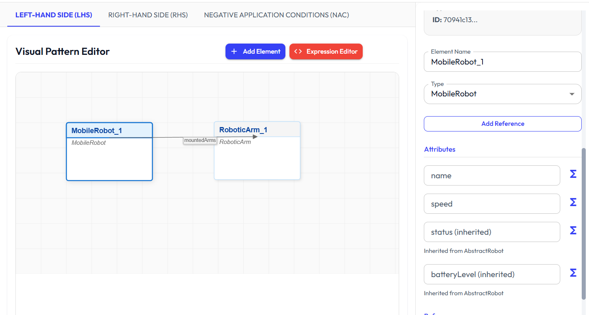

# Transformation Rule Creation and Execution

---

## Relevant Files

- [`src/components/transformation/TransformationDashboard.tsx`](../src/components/transformation/TransformationDashboard.tsx): Main dashboard for transformation rule editing and execution.
- [`src/components/transformation/TransformationRuleEditor.tsx`](../src/components/transformation/TransformationRuleEditor.tsx): Editor for creating, editing, and managing transformation rules and patterns.
- [`src/components/transformation/TransformationExecutionPanel.tsx`](../src/components/transformation/TransformationExecutionPanel.tsx): Panel for configuring, running, and reviewing transformation executions.
- [`src/components/transformation/ExpressionEditor.tsx`](../src/components/transformation/ExpressionEditor.tsx): Editor for expressions and constraints attached to rules and patterns.
- [`src/components/transformation/RuleDownloadButton.tsx`](../src/components/transformation/RuleDownloadButton.tsx): Button for exporting rules as JSON files.
- [`src/components/transformation/RuleFileUploader.tsx`](../src/components/transformation/RuleFileUploader.tsx): Component for importing rules from JSON files.
- [`src/services/transformation.service.ts`](../src/services/transformation.service.ts): Service for rule storage, pattern matching, execution logic, import/export, and execution history.
- [`src/models/types.ts`](../src/models/types.ts): Type definitions for transformation rules, patterns, elements, and executions.

---

This document describes the process and features related to creating and executing transformation rules within the modeling tool. The transformation module enables users to define, manage, and apply transformation rules to models, supporting a range of transformation scenarios.

  

  

## Overview

Transformation rules are used to specify how models can be changed or generated based on defined patterns. The transformation module provides a set of interfaces and tools for creating, editing, importing, exporting, and executing these rules. The process is organized into two main activities: rule creation and rule execution.

---

## Transformation Rule Creation

### Rule Editor
- The rule editor is accessed through the Transformation Dashboard, which provides a dedicated tab for rule management.
- Users can create new transformation rules, assign names, descriptions, and priorities, and enable or disable rules as needed.
- Each rule consists of patterns:
  - **LHS (Left-Hand Side):** Defines the pattern to be matched in the source model.
  - **RHS (Right-Hand Side):** Specifies the pattern to be created or modified in the target model.
  - **NAC (Negative Application Condition):** Optional patterns that, if matched, prevent the rule from being applied.
- Patterns are composed of elements and references, which are visually edited on a canvas. Elements represent model entities, and references represent relationships between them.
- Users can add, edit, or remove pattern elements, set their types, and define attributes and references. The editor supports drawing references between elements and configuring their properties.
- Expressions and constraints can be attached to patterns or elements, allowing for more precise control over when and how rules are applied.
- The editor provides dialogs for editing global expressions, selecting metaclasses, and configuring references.
- Rules and patterns are stored locally and can be updated or deleted as needed.

### Importing and Exporting Rules
- Rules and their associated patterns can be exported as JSON files for sharing or backup.
- The module provides buttons to download individual rules or all rules at once.
- Rules can be imported from JSON files, allowing users to bring in rules created elsewhere. The import process provides feedback on success or errors.

---

## Transformation Rule Execution

### Execution Configuration
- The execution panel allows users to configure and run transformation executions.
- Users select a source model and one or more transformation rules to apply.
- Execution strategies can be chosen:
  - **Sequential:** Rules are applied in order.
  - **Priority-based:** Rules are applied based on their assigned priority.
  - **Interactive:** Users can step through rule applications one at a time.
- Additional options include setting the maximum number of iterations and choosing between in-place (modifying the source model) or out-of-place (creating a new model) transformations.
- Executions are named and tracked for later review.

### Running Executions
- Once configured, executions can be started with a button click.
- The system applies the selected rules to the source model according to the chosen strategy and options.
- For interactive executions, users can advance through each step manually.
- The execution process records each step, including which rules were applied, which elements were matched, and what changes were made.

### Results and Visualization
- After execution, results are displayed in a dedicated tab.
- Users can compare the source and result models side by side, with visual representations of elements and their relationships.
- Each execution step can be reviewed, showing which elements were affected and what changes occurred.
- Executions can be downloaded as JSON files for record-keeping or further analysis.

### Managing Executions
- All past executions are listed and can be reviewed or deleted.
- The system maintains a history of executions, including their configuration and results.

---

