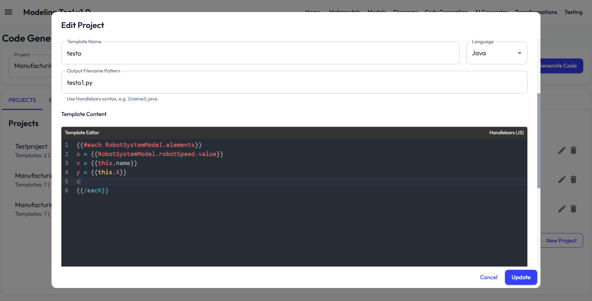

# Code Generation Guide

This guide explains how to create code generation projects, manage templates, and produce downloadable outputs.

  

  

## Code generation fundamentals

Code generation is project-based.

A project contains:

- project metadata (name, description)
- target metamodel
- one or more templates

Each template contains:

- language (`java` or `python`)
- template content (Handlebars-style)
- output filename pattern

## Open the code generation workspace

You can open code generation in two ways:

- from navigation (standalone page)
- from a view card (`Generate Code`)

When opened from a view context, generation prioritizes that view's model context where applicable.

## Select or create a project

At the top of the page:

1. Select existing project from project selector.
2. Or create a new project.

For new projects provide:

- project name
- target metamodel
- optional description

## Import a project JSON

You can import a reusable code generation project without bundling it into the
application.

1. Open the Projects tab.
2. Click Import Project.
3. Select a `.json` file containing a code generation project.

The importer accepts:

- a single project object
- an array of project objects
- an object with a `projects` array

Imported projects are normal user projects. If an imported project or template ID
collides with an existing one, the importer keeps your existing project and
generates a new ID for the imported copy.

Importable Smart Warehouse examples are available under `examples/codegen-projects/`:

- `smart-warehouse-omniverse-project.json`: generates an Omniverse/OpenUSD scene script.
- `smart-warehouse-visual-components-project.json`: generates Visual Components setup, OPC UA, MAS config, and position files.

## Manage templates in a project

Projects support multiple templates (tabbed editor inside project dialog).

Template fields:

- template name
- language (Java/Python)
- output filename pattern (example: `{{name}}.java`)
- template content

Multiple template tabs let you generate multi-file outputs from one run.

## Use example templates and projects

The workspace provides:

- Example Templates tab
- preloaded example projects/templates

You can start from an example and adapt it to your metamodel.

## Generate code

Generation flow:

1. Select project.
2. Click Generate.
3. Review generated files in Generated Files tab.
4. Download one file or download all as ZIP.

Model selection behavior:

- service resolves models conforming to project target metamodel
- when view context exists, it prioritizes that view's model
- generation can run view-based or model-based paths

## Template syntax and helpers

Templates support Handlebars-style expressions and helpers.

Common helper examples in UI:

- `capitalize`
- `lowercase`
- `camelCase`
- `snakeCase`

The editor also includes autocompletion support for template authoring.

## Generated outputs

Generated Files tab provides:

- file list
- file content preview
- single-file download
- bulk ZIP download

## Edit, delete, and share projects

Project-level operations include:

- edit project and templates
- delete project
- share project with other users (if permitted)

Sharing follows role/permission behavior defined for resource sharing.

## Common issues and fixes

### No output generated

Cause: project has no valid templates or no compatible models.

Fix: verify target metamodel and template list.

### Generation fails with model error

Cause: no model found for selected target metamodel.

Fix: create or select a model conforming to the target metamodel.

### Filename pattern problems

Cause: invalid or empty output pattern.

Fix: use a valid Handlebars pattern and include extension.

### Template variable not resolving

Cause: variable path does not exist in generation context.

Fix: inspect available context and adjust variable names.

### Unintended project overwrite behavior

Cause: editing existing project while expecting new copy.

Fix: create a new project when branching template sets.

## Recommended workflow

1. Finalize metamodel and model first.
2. Create small project with one template.
3. Generate and inspect output.
4. Add additional templates for multi-file generation.
5. Share project once stable.

## Relevant files

- `frontend/src/components/codegeneration/CodeGenerator.tsx`: Main code generation workspace UI.
- `frontend/src/services/codegeneration/codegeneration.service.ts`: Frontend code generation orchestration service.
- `frontend/src/services/codegeneration/codegen-generation-engine.service.ts`: Template execution and output assembly logic.
- `frontend/src/services/codegeneration/templateAutocomplete.service.ts`: Template editor completion helpers.
- `backend/src/routes/codegen.routes.ts`: Backend API endpoints for projects, templates, and generation operations.

## Related docs

- [Metamodels](metamodels.md)
- [Models](models.md)
- [Visual Components Code Generation](visual-components-code-generation.md)
- [Omniverse Code Generation](omniverse-code-generation.md)
- [API Reference](../reference/api.md)
