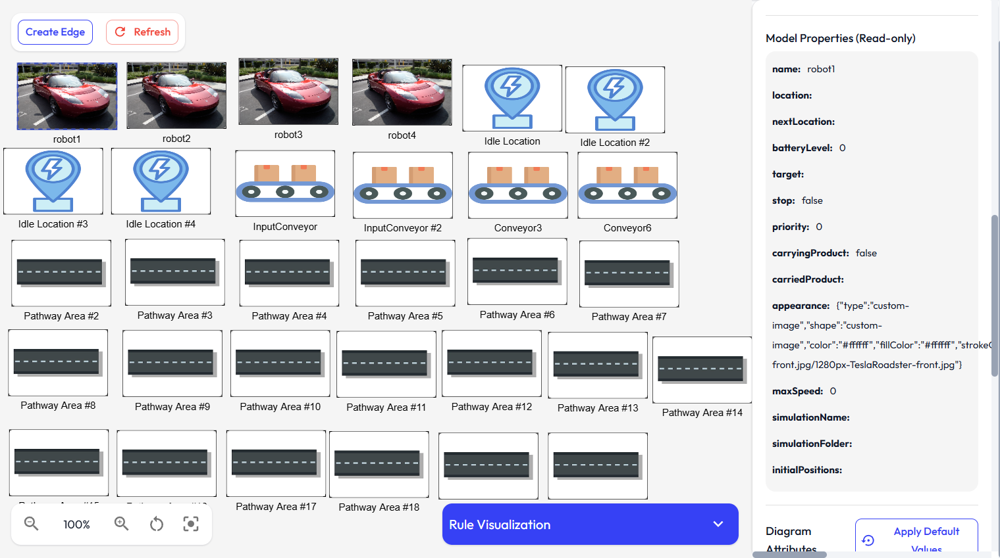

# Views Guide (2D and 3D)

This guide explains how to create, edit, and manage model views in both 2D and 3D modes. Existing routes and APIs may still use the word `diagram` for compatibility.
A tutorial video demonstrating how to design a metamodel end-to-end can be found [here](../../videos/diagram_creation.mkv).

  

  

## View fundamentals

A view is linked to a model. It is a projection of model elements, not a separate copy of those elements.

A view stores:

- name
- target model
- optional viewpoint and representation description
- included model element ids
- grid settings

The model stores:

- instance identity
- attributes and references
- canonical 2D/3D positions, sizes, rotation, and appearance overrides
- connection metadata

Changing a model element through one view updates the model and therefore affects every view that includes that element.

Views may also be linked to a viewpoint and representation description. The representation description controls which metaclasses are visible, which metaclasses can be created from the palette, and which notation overrides apply.

## Create, import, and export views

From the Views page you can:

- create a new view by selecting a target model
- import a view from JSON
- export an existing view as JSON
- open a view in the editor
- open code generation from a view card

Creation flow:

1. Open Views.
2. Click Create View.
3. Enter name.
4. Select model.
5. Select viewpoint and diagram representation if more than one is available.
6. Open view.

If no models exist, the UI prompts you to create a model first.

Only executable `diagram` representation descriptions are selectable when creating a view. Reserved `table` and `tree` specifications are hidden until editors for those kinds exist.

## Switch between 2D and 3D

Inside the view editor page you can switch modes using:

- 2D Mode button
- 3D Mode button

Both modes edit the same view resource with different interaction styles.

## 2D editor workflow

### Add model elements to a view

- Drag remaining model elements from the palette onto canvas.
- Use Add all to include every model element that is not already in the view.
- A model element can appear at most once in the same view.
- Palette contents are filtered by the active representation description.

### Select and edit

- Click an element to open its properties.
- Drag nodes to reposition. Position is written back to the model element's canonical presentation data.

### Create edges (references)

1. Click Create Edge in toolbar.
2. Select source node.
3. Select target node.
4. If multiple compatible references exist, select one in dialog.

Behavior notes:

- supports self-references when metamodel allows them
- edge bend points can be added by clicking empty canvas while edge drawing is active
- edge labels and containment visual markers are shown
- edges connected to semantic pins anchor to the pin center

### Create semantic pins

Pins appear when the active representation description defines pin mappings.

Recommended flow:

1. Select a compatible owner node.
2. In the properties panel, find Pins.
3. Click the available Add Pin action.
4. Drag the pin around the owner boundary to change side and offset.

Pin behavior:

- pins are model elements with their own metaclass
- the owner reference is stored in the model
- the current view includes the new pin automatically
- the pin remains attached when the owner moves
- invalid owner/pin combinations and disallowed sides are rejected

### Navigation tools

2D toolbar provides:

- zoom in/out
- reset view
- center elements
- refresh

## 3D editor workflow

### Place elements

- Drag from palette and click on grid to place.

### Select and move

- Click element to select.
- Drag selected element directly to move it.

### Camera and scene

- orbit controls are enabled for navigation
- scene includes grid floor and status overlay

### Grid behavior

3D editor supports grid controls with:

- independent X/Y axis sizing
- slider-based size adjustment
- axis selection for partial updates

Grid settings are persisted to view data.

### Performance handling

3D editor includes low-performance mode and WebGL error handling fallback messaging.

## Element properties panel

The properties panel supports:

- editing model element names and attributes through the view
- type-aware input fields (string, number, boolean, date)
- applying default values for class attributes
- edge-specific reference type handling

## Appearance and notation

Views use the active representation description when one is selected. Legacy views fall back to metaclass notation defined in the metamodel editor. A model element can override notation for exceptional cases, then reset back to the representation or metaclass default.

Supported notation includes 2D shapes, colors, image assets, 3D model assets, default sizes, and reference edge styling.

The palette uses the active representation description: existing elements are filtered by visible metaclasses, and create-new-instance entries are filtered by creatable metaclasses.

Notation resolution order is:

1. instance presentation override
2. representation description override
3. viewpoint shared default
4. metaclass fallback
5. built-in fallback

## Delete and maintenance actions

In view list and editor workflows you can:

- delete view
- remove model elements from the view without deleting them from the model
- refresh visual state after updates

## Common issues and fixes

### Cannot create view

Cause: no model selected or no model exists.

Fix: create/select model first.

### Edge creation fails

Cause: no compatible metamodel reference between selected source and target.

Fix: verify metamodel reference definitions and target compatibility.

### 3D element not placing where expected

Cause: camera angle or grid interpretation.

Fix: reorient camera, use status overlay hints, and place again on grid.

### Palette is empty

Cause: all visible model elements are already included in the current view, or the representation description hides all remaining metaclasses.

Fix: create more instances in the model editor, remove an element from the view and add it again later, or ask a DSL designer to update visible/creatable metaclasses in the representation description.

### Pin action is missing

Cause: selected node is not compatible with any pin mapping, or the pin metaclass is not visible/creatable in the active representation.

Fix: update the representation description pin mapping and visible/creatable metaclass lists.

### Imported view fails

Cause: invalid JSON or missing referenced model.

Fix: ensure referenced model exists and JSON format is correct.

## Recommended workflow

1. Create model first.
2. Create a view for that model.
3. Add existing model elements to the view.
4. Switch to 3D for spatial organization if needed.
5. Use the viewpoint representation editor for perspective-specific appearance and palette rules.
6. Use the metamodel Notation tab for fallback class-level appearance.
7. Use instance overrides only for exceptional elements.

## Relevant files

- `frontend/src/components/diagram/DiagramEditor.tsx`: Primary 2D view editor component.
- `frontend/src/components/diagram/Diagram3DEditor.tsx`: 3D view editor and interaction layer.
- `frontend/src/components/palette/DiagramPalette.tsx`: Palette of model elements not yet included in the current view.
- `frontend/src/services/diagram/view-projection.service.ts`: Materializes views from model elements and references.
- `frontend/src/services/diagram/diagram.service.ts`: Frontend view/diagram compatibility service orchestration.
- `backend/src/routes/diagram.routes.ts`: Backend compatibility endpoints for view CRUD and membership updates.

## Related docs

- [Models](models.md)
- [Viewpoints and Representation Descriptions](viewpoints.md)
- [Code Generation](code-generation.md)
