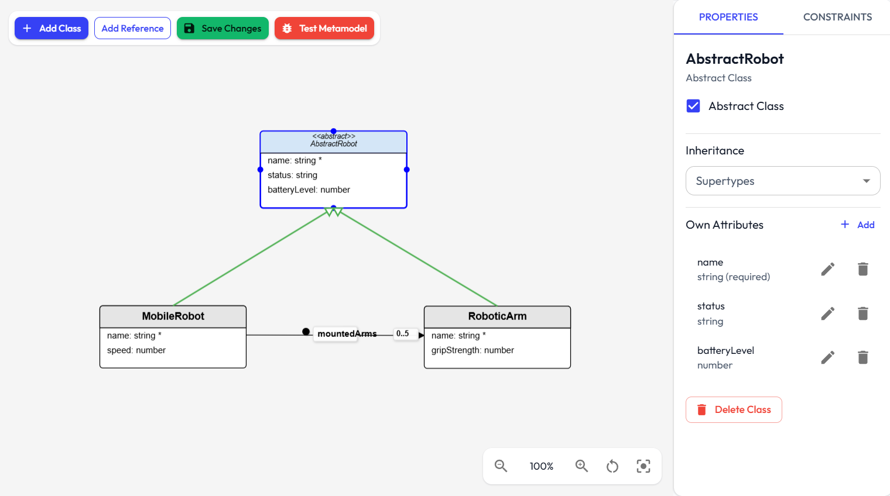

# Metamodels Guide

This guide explains how to create and maintain metamodels (your domain language definition) in the application.
A tutorial video demonstrating how to design a metamodel end-to-end can be found [here](../../videos/metamodel_creation.mkv). 

   

  

## Before you start

You should be able to access the Metamodels page from the main navigation.

What you define in a metamodel becomes available later in:

- model creation
- diagram editors
- transformation rules
- code generation templates
- testing workflows

## Metamodel basics

A metamodel defines:

- classes (domain concepts)
- attributes (data fields)
- references (relationships between classes)
- constraints (validation rules)

## Create a metamodel

1. Open Metamodels.
2. Click Create Metamodel.
3. Enter a name.
4. Open the created metamodel in the visual editor.

The editor stores class positions on canvas and keeps structural details in the metamodel data.

## Import and export

Supported import formats:

- JSON
- Ecore or XMI

Supported export formats:

- JSON
- Ecore

Typical flow:

1. Click Import on the Metamodels list panel.
2. Select file.
3. Confirm import.
4. Validate and adjust classes/references after import.

## Create and manage classes

Use the visual editor to add classes and edit their metadata.

Key class properties:

- name
- abstract flag
- supertypes (inheritance)

Practical guidance:

- keep class names unique and meaningful
- use abstract classes for shared behavior that should not be instantiated directly
- prefer clear inheritance over duplicated attributes

## Define attributes

Each class can have attributes with:

- name
- type: string, number, boolean, date
- required flag
- default value
- many flag (multi-valued)

Attribute validation is enforced when model elements are validated against the metamodel.

## Define references

References connect source class to target class and include:

- reference name
- target class
- containment flag
- lower and upper cardinality
- opposite reference (for bidirectional consistency)
- allow self-reference (optional)

Cardinality matters in model validation:

- lower bound enforces required links
- upper bound enforces max number of linked targets

## Reference attributes

References can also carry their own attributes. Use reference attribute editing when you need data on the relation itself (not only on source/target nodes).

## Inheritance behavior

Inheritance can be used for both attributes and references. In model validation and editing flows, inherited members are treated as part of the effective class definition.

## Constraints: OCL and JavaScript

Constraint editing is split by type:

- OCL Constraints tab
- JavaScript Constraints tab

### OCL constraints

Use for declarative model rules. Typical fields:

- name
- context class
- expression
- severity (error, warning, info)
- optional description

### JavaScript constraints

Use for procedural or advanced rule logic. The editor performs syntax checks and stores constraints as JavaScript-type constraints.

### Choosing between OCL and JavaScript

- choose OCL for readable domain rules and collection logic
- choose JavaScript for custom logic that is difficult to express in OCL

For OCL syntax examples, see [frontend/src/examples/ocl-examples.ts](../../frontend/src/examples/ocl-examples.ts).

## Validate a metamodel

Metamodel validation checks structural consistency, including:

- required metadata
- valid target classes for references
- opposite reference consistency
- bidirectional reference correctness

Validate regularly while editing to catch design issues before model creation.

## Update and delete behavior

- edits are persisted through API-backed services
- deleting classes/references/attributes immediately affects future model conformance
- deleting a metamodel can be blocked when dependent resources exist

## Sharing and access behavior

Depending on role and share permission:

- owners can fully manage their metamodels
- shared users may have viewer or editor-level access
- viewer-level users cannot perform editing operations

See [Roles and Sharing](roles-and-sharing.md) for user-facing access rules.

## Common mistakes and fixes

### Missing target class in reference

Cause: reference points to deleted or invalid class.

Fix: edit reference target or recreate the target class.

### Inconsistent opposite references

Cause: one direction set, reverse direction missing/wrong.

Fix: define matching opposite references on both sides.

### Overusing inheritance

Cause: deep trees that are hard to maintain.

Fix: keep inheritance shallow and explicit.

### Mixing OCL and JavaScript syntax

Cause: writing OCL syntax in JavaScript tab or vice versa.

Fix: move rule to correct constraint type tab.

## Recommended workflow

1. Create classes and inheritance.
2. Add attributes and references.
3. Define constraints.
4. Validate metamodel.
5. Create models that conform to it.

## Relevant files

- `frontend/src/components/metamodel/MetamodelManager.tsx`: Main metamodel list/create/import/export UI.
- `frontend/src/components/metamodel/VisualMetamodelEditor.tsx`: Visual editor for classes, references, and layout.
- `frontend/src/components/metamodel/OCLConstraintEditor.tsx`: OCL constraint authoring panel.
- `frontend/src/services/metamodel/metamodel.service.ts`: Frontend metamodel orchestration and state operations.
- `backend/src/routes/metamodel.routes.ts`: Backend API endpoints for metamodel CRUD and related actions.

## Related docs

- [Models](models.md)
- [Roles and Sharing](roles-and-sharing.md)
- [Data Model](../reference/data-model.md)
