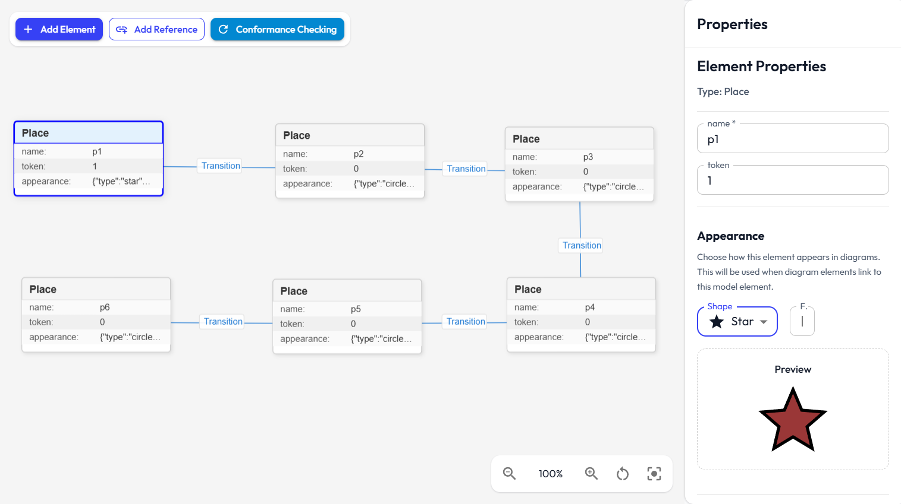

# Models Guide

This guide explains how to create and edit models that conform to your metamodel definitions.
A tutorial video demonstrating how to design a model can be found [here](../../videos/model_creation.mkv).

  

  

## Model fundamentals

A model:

- conforms to one metamodel
- contains model elements (instances of metaclasses)
- stores attribute values and references between elements
- can be validated against structural rules and constraints

## Create a model

1. Open Models from navigation.
2. Click Create Model.
3. Enter model name.
4. Choose the metamodel to conform to.
5. Create and open the model in the visual editor.

## Import and export models

Supported import format:

- JSON model file

Import checks include:

- model structure validity
- referenced metamodel existence

Supported export format:

- JSON model file

## Add elements

Inside the visual model editor:

1. Click Add Element.
2. Select element type (metaclass).
3. Element is created on canvas and selected for editing.

Element placement behavior:

- new elements are added near the visible center
- editor attempts to reduce direct overlap with existing elements

## Edit element data

Select an element to edit its values.

Typical editable data includes:

- metamodel-defined attributes
- style-related properties (for visualization)

Attribute behavior:

- required attributes must be provided for valid models
- type conformance is checked during validation

## Create references between elements

Reference creation flow:

1. Start reference creation mode.
2. Choose source and target elements.
3. Select compatible reference type.
4. Confirm and save.

Important behaviors:

- compatibility is checked against metamodel target type
- reference cardinality rules are validated later
- self-reference follows allow-self-reference metamodel rule

## Reference attributes and edge routing

If a metamodel reference has attributes, they can be filled when creating the reference.

For visual clarity, references can include bend points in the editor to route edges around dense areas.

## Appearance and style customization

Element appearance can be customized through the appearance selector.

Supported appearance types include:

- default
- square
- rectangle
- circle
- triangle
- star
- custom image
- custom 3D model

Custom asset support:

- image uploads (for custom-image)
- GLB uploads (for custom-3d-model)

Limits and behavior:

- image uploads use size limits and are stored via file storage service
- 3D model uploads are expected as GLB and use file storage service

## Validation behavior

Model validation checks:

- required attributes
- attribute type conformance
- reference lower and upper bounds
- reference target type correctness
- opposite reference consistency
- containment hierarchy rules (including cycle detection)
- OCL constraints
- JavaScript constraints

Validation output includes severity and affected element context.

## Update and delete behavior

- element edits are persisted through API-backed services
- deleting an element also affects references pointing to it
- deleting a model removes it from model lists and dependent views

## Sharing and access behavior

Model actions depend on role and resource permissions.

Typical rules:

- owners have full control
- shared users can be viewer or editor
- viewer access is read-only

See [Roles and Sharing](roles-and-sharing.md).

## Common issues and fixes

### Required fields missing

Symptom: validation reports missing required attribute/reference.

Fix: fill required fields or adjust metamodel definition.

### Type mismatch

Symptom: value entered but flagged invalid.

Fix: match attribute type exactly (string/number/boolean/date).

### Invalid reference target

Symptom: reference created but fails validation.

Fix: ensure target element type matches reference target metaclass (or compatible subtype).

### Broken bidirectional links

Symptom: opposite reference consistency errors.

Fix: check and synchronize both sides of opposite references.

### Unknown property warnings

Symptom: warnings for properties not in metamodel.

Fix: remove accidental fields or update metamodel to include intended attribute.

## Recommended workflow

1. Finalize metamodel first.
2. Create model and add core elements.
3. Fill attributes.
4. Add references.
5. Adjust appearance where needed.
6. Run validation and fix issues.

## Relevant files

- `frontend/src/components/model/ModelManager.tsx`: Main model list/create/import/export UI.
- `frontend/src/components/model/VisualModelEditor.tsx`: Visual model editor for elements and references.
- `frontend/src/components/model/ModelElementAppearanceSelector.tsx`: Appearance controls for model elements.
- `frontend/src/services/model/model.service.ts`: Frontend model service orchestration.
- `backend/src/routes/model.routes.ts`: Backend API endpoints for model CRUD, elements, and references.

## Related docs

- [Metamodels](metamodels.md)
- [Diagrams (2D and 3D)](diagrams.md)
- [Roles and Sharing](roles-and-sharing.md)
