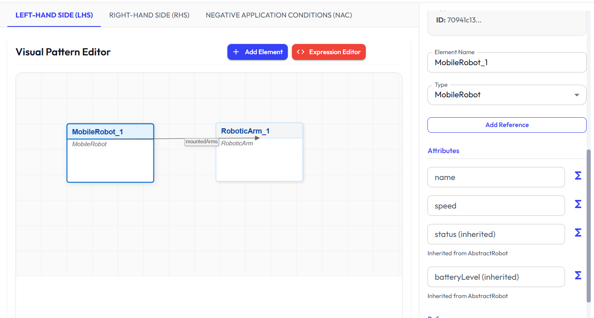

# Transformations Guide

This guide explains how to define transformation rules and use the transformation workspace.
A tutorial video demonstrating how to create a transformation rule can be found [here](../../videos/transformation_rule_creation.mkv).

  

  

## Transformation fundamentals

A transformation rule describes how a source pattern is matched and how result elements are produced.

Core concepts:

- LHS (left-hand side): match pattern
- RHS (right-hand side): output pattern
- NAC (negative application condition): forbidden pattern(s)
- priority: ordering/precedence signal
- enabled flag: active/inactive state

## Transformation workspace layout

Open Transformations from the main navigation. The dashboard has two tabs:

- Rule Editor
- Execution

Use Rule Editor to author and manage rules. Use Execution tab to run transformation flows.

## Create a transformation rule

Typical rule-authoring flow:

1. Open Rule Editor.
2. Create new rule and assign a name.
3. Define LHS pattern structure.
4. Define RHS pattern structure.
5. Add NAC patterns if needed.
6. Set priority and enabled state.
7. Save and verify rule list updates.

## Rule structure details

A rule contains embedded pattern objects (not separate persisted pattern entities in backend API):

- `lhsPattern`
- `rhsPattern`
- `nacPatterns[]`

Patterns typically include:

- pattern name/type
- pattern elements
- attributes/references constraints

## Update, enable/disable, and delete rules

Supported management operations:

- edit rule metadata (name, description, priority)
- update embedded pattern content
- enable/disable rule
- delete rule (owner-level restrictions apply)

## Execution behavior

Execution tab is used to run transformation processes and inspect outcomes.

Important implementation note for users:

- backend API fully supports rule CRUD
- some execution/pattern workflows are handled client-side service logic and compatibility routes

This means authoring and managing rules is stable, while execution behavior may depend on current frontend orchestration paths.

## Practical rule-authoring tips

- start with small, single-purpose rules
- keep NACs minimal and explicit
- use priorities only when deterministic order is required
- avoid overloading one rule with too many concerns

## Common issues and fixes

### Rule created but no expected effect

Cause: mismatch between LHS conditions and actual model state.

Fix: simplify LHS and verify element/attribute names.

### Rule blocked unexpectedly

Cause: NAC pattern is matched, so rule application is intentionally prevented.

Fix: review NAC logic and reduce overly broad conditions.

### Ambiguous ordering

Cause: multiple rules overlap with same intent.

Fix: adjust priorities and rule scope.

### Pattern references confusion

Cause: expecting standalone pattern persistence while backend stores embedded patterns inside rules.

Fix: manage patterns through rule objects in Rule Editor.

## Recommended workflow

1. Finalize metamodel and baseline models.
2. Create one transformation rule at a time.
3. Verify outcomes incrementally.
4. Add NAC and priority only when needed.
5. Keep rules readable and modular.

## Relevant files

- `frontend/src/components/transformation/TransformationDashboard.tsx`: Main transformations workspace container.
- `frontend/src/components/transformation/TransformationRuleEditor.tsx`: Rule authoring UI for LHS/RHS/NAC and metadata.
- `frontend/src/components/transformation/TransformationExecutionPanel.tsx`: Execution tab UI and result views.
- `frontend/src/services/transformation/transformation.service.ts`: Frontend transformation service orchestration.
- `backend/src/routes/transformation.routes.ts`: Backend API endpoints for transformation rule CRUD and execution paths.

## Related docs

- [Metamodels](metamodels.md)
- [Models](models.md)
- [API Reference](../reference/api.md)
